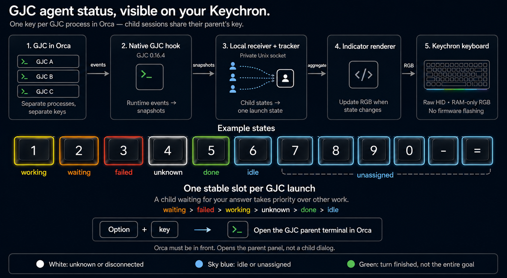

<p align="center">
  <a href="#gjc-keychron"></a>
  <a href="#basic-keychron"></a>
</p>

<div align="center">

# Orca Keychron

### See status in your keys. Jump to the terminal that needs you.

**Basic Keychron · Gajae Code Keychron — choose the mode that fits your workflow.**


**English** · [한국어](README.ko.md)

</div>

Run multiple tasks in Orca without watching every terminal.
Read their status on your Keychron number keys, then press `Option + indicator key` to reach the terminal that needs you.

## Which version should I use?

**One `orca-keychron` package includes both modes**, available together since v0.1.3.
Here, “version” means a usage mode. Run only one mode per keyboard at a time.

| Choose by | Basic Keychron — Orca mode | Gajae Code Keychron — GJC mode |
|---|---|---|
| Best for | Agents and worktrees managed by Orca | Gajae Code and its child agents running in Orca terminals |
| One key represents | One worktree | One interactive `gjc` launch |
| Status source | Periodic Orca CLI queries | Changes pushed by a GJC native hook |
| `Option + indicator key` | Opens and cycles through agents needing attention in the worktree | Opens the parent terminal that launched GJC |
| Command | `orca-keychron` | `orca-keychron-gjc` |

[Start Basic Keychron](#basic-keychron) · [Start Gajae Code Keychron](#gjc-keychron) ·
[Switch modes](#switch-modes) · [Troubleshooting](#troubleshooting) · [Development](#development)

## Shared requirements and installation

- macOS with Python 3.9 or newer and [uv](https://docs.astral.sh/uv/).
- Orca running, with the `orca` CLI available on `PATH`.
- A compatible Keychron keyboard connected over USB. Bluetooth usually does not expose the required raw HID interface.
- Firmware supporting the per-key `KC_RGB` command `0xA8`. Verified on the **Keychron Q65 Max**; `setup` checks support.

```bash
uv tool install 'orca-keychron>=0.1.3'
```

Already installed? Run `uv tool upgrade orca-keychron`.
**The package version and GJC version are separate.** GJC mode additionally requires **GJC 0.16.4**.

<p align="center">
  
</p>

<a id="basic-keychron"></a>
## 1. Basic Keychron — Orca mode

**Use this mode to manage coding agents by worktree.** It supports agents whose status Orca
reports, including Codex, Claude Code, and Grok, with local and paired hosts included by default.
No agent-specific hooks are required.


### Get started

If another mode is running, follow [Switch modes](#switch-modes) first.

```bash
orca-keychron setup
```

Setup verifies Orca connectivity and keyboard support, then previews the indicator zone.
After preparing configuration and macOS permissions, it **installs and starts the login service**.
The default indicator zone is `1 2 3 4 5 6 7 8 9 0 - =`.
Start an agent task in Orca to see its assigned key change color. With Orca frontmost, press `Option + indicator key` to navigate.

```bash
orca-keychron status
orca-keychron autostart status
```

To run manually without autostart, use this path instead of the setup command above:

```bash
orca-keychron setup --no-autostart
orca-keychron run
```

For one-off use, the same commands are available through `uvx orca-keychron setup --no-autostart`
and `uvx orca-keychron run`.

### Colors and navigation

| Color | Meaning |
|---|---|
| 🟡 Yellow | Working |
| 🟠 Orange | Waiting for an answer or approval |
| 🔴 Red | Blocked or failed; needs attention |
| 🟢 Green | Completion reported by Orca |
| 🟣 Magenta | Multiple kinds of waiting, blocked, or done states need attention |
| 🩵 Sky blue | Retained slot without an active agent, or an unassigned key |

Working agents alone do not create a mixed state. When multiple agents need attention,
release and press `Option + the same indicator key` again to cycle through
**blocked → waiting → done** targets. Historical completion records are ignored until activity
has first been observed in the same pane.

<a id="gjc-keychron"></a>
## 2. Gajae Code Keychron — GJC mode

**Use this mode to follow [Gajae Code](https://github.com/Yeachan-Heo/gajae-code) running inside Orca.**
Install the hook, then launch `gjc` normally. No GJC source changes or launch wrapper are required.
**This mode receives launches on the current computer**; it does not aggregate paired remote hosts like basic mode.

### How it works at a glance

[](assets/img5.png)

*Click the diagram to enlarge it. The colors are example states, not permanent colors assigned to particular key numbers.*

1. **Assign a key:** Each interactive `gjc` launch gets one key. Child agents share their parent's key.
2. **Show status:** The hook sends observed states to the local receiver, and the key color follows the state priority.
3. **Open the terminal:** With Orca frontmost, press `Option + indicator key` to open the parent terminal that launched GJC.

### A practical example

Starting with empty slots:

```text
Launch gjc in terminal A → key 1
Launch gjc in terminal B → key 2
Create 10 child agents inside A → their states all contribute to key 1
```

**In A, even if 10 agents are working, one observed unanswered question makes key 1 orange.**
Colors are not decided by majority vote. B independently displays its status on key 2.
`Option + 1` opens parent terminal A. It does not expand a child-agent list or open a child's answer screen directly.

### Get started

If another mode is running, follow [Switch modes](#switch-modes) first.

1. Check that `gjc --version` reports **`gjc/0.16.4`**.
2. Configure the keyboard and install the GJC hook.

   ```bash
   orca-keychron-gjc setup
   orca-keychron-gjc install --dry-run
   orca-keychron-gjc install
   ```

3. Start the indicator. Leave this terminal running.

   ```bash
   orca-keychron-gjc run
   ```

4. Launch `gjc` in **another Orca terminal**. Existing GJC processes must be restarted after finishing their current work to load the new hook.
5. Check connectivity from another terminal.

   ```bash
   orca-keychron-gjc doctor
   orca-keychron-gjc status
   ```

GJC's `setup` only prepares configuration. To start automatically at login, stop the foreground
`run` with `Ctrl-C`, then run:

```bash
orca-keychron-gjc autostart install
orca-keychron-gjc autostart status
```

### Reading the colors

| Color | Meaning |
|---|---|
| 🟠 Orange | Observed unresolved question or decision request |
| 🔴 Red | Observed turn or worker failure |
| 🟡 Yellow | Working |
| ⚪ White | Disconnected or uncertain state |
| 🟢 Green | Current response turn ended; this does not mean the whole goal is complete |
| 🩵 Sky blue | Waiting for input, or an unassigned key |

For a connected launch, priority is **waiting → failed → working → unknown → done → idle**.
A disconnected launch turns white instead of retaining its previous color, and keeps its slot.
Status changes are pushed as events; a 2-second heartbeat and an 8-second lease also track connectivity.

### Restarts and leftover slots

Children and `/new` inside the same GJC process share its key. Receiver restarts and reconnects
can restore existing assignments, but **starting a new GJC process creates a new launch identity**.
When all keys are occupied, additional launches wait for a free slot.

A normal shutdown releases the slot. If a crash leaves a white slot, keep the receiver running,
find the launch ID with `orca-keychron-gjc status`, then use `orca-keychron-gjc clear <launch_id>`.
**Only disconnected launches whose processes are confirmed to have exited can be cleared.**
Live processes and uncertain exit states keep their slots.

### Question forwarding and supported behavior

Not every approval dialog is observable. The installer also provides `keychron-decision-worker`,
which you can opt into for forwarding child questions to the parent. Installation alone does not automatically forward every child question. See the [GJC user guide](docs/gjc-guide.md) for supported behavior and the question-forwarding workflow.

<a id="switch-modes"></a>
## Switching, upgrading, and uninstalling

**Do not run both modes at once.** Stop any foreground `run` with `Ctrl-C`, remove the existing
mode's service, then follow the startup instructions for the desired mode.

| Switch | Run first | Then |
|---|---|---|
| Basic → GJC | `orca-keychron autostart uninstall` | Follow GJC setup, hook installation, and startup |
| GJC → Basic | `orca-keychron-gjc autostart uninstall` | Run basic mode's `orca-keychron setup` |

If the target mode's configuration and hooks are already prepared, its `autostart install`
command enables the login service. A shared lock prevents the two indicators from controlling
the device together; it does not exclude other software such as Keychron Launcher.

Upgrade with `uv tool upgrade orca-keychron`. GJC users should then rerun
`orca-keychron-gjc install` and restart GJC to load the updated hook.

To uninstall, stop any foreground `run` and run the active mode's `autostart uninstall`.
If GJC hooks were installed, also run `orca-keychron-gjc uninstall`, then remove the package
with `uv tool uninstall orca-keychron`. Saved configuration and logs are retained.

## Shared settings and macOS permissions

Both modes use `Option + indicator key` while Orca is frontmost. No long press is needed.
Ordinary number input, shortcuts in other apps, and combinations with extra modifiers are not intercepted.

In **System Settings → Privacy & Security → Accessibility / Input Monitoring**, allow the
Python executable or terminal running the indicator. Restart your chosen mode after changing permissions.

| Setting | Basic Keychron | Gajae Code Keychron |
|---|---|---|
| Configuration file | `~/Library/Application Support/orca-keychron/config.json` | `~/Library/Application Support/orca-keychron/gjc/config.json` |
| Change indicator positions | `orca-keychron setup --leds 1,2,3` | `orca-keychron-gjc setup --leds 1,2,3` |
| More options | `orca-keychron run --help` | `orca-keychron-gjc run --help` |

LED numbers are firmware positions, not printed key labels. Check positions with setup's preview.
For a custom GJC socket, run `orca-keychron-gjc setup --socket /absolute/path/bridge.sock` before
installing the hook. Reinstall the hook after changing the socket setting.

<a id="troubleshooting"></a>
## Troubleshooting and validation scope

| Symptom | Check first |
|---|---|
| No indicator lights | USB, `KC_RGB` support, and errors from the selected mode's `run`. Use basic `status`, or GJC `doctor` and `status` |
| Device already in use | Stop the other mode's service or foreground `run`, and Keychron Launcher's lighting control |
| Shortcut does nothing | Orca must be frontmost; check Accessibility and Input Monitoring permissions |
| GJC key is white | Check GJC restart, hook installation, and receiver connectivity. White alone does not remove a launch |
| Previous lighting looks different after exit | Effects and brightness are restored, but unreadable RAM-only custom frames must be reapplied manually |

RGB frames are written to RAM without `SaveLedConf`. This project does not send status to its
own external collection service. Basic mode uses the Orca CLI; GJC mode uses a local socket.

GJC integration was validated with the actual 0.16.4 runtime and local response fixtures.
Q65 Max RGB frame acknowledgments and lighting restoration, plus separate Orca pane navigation,
were also checked. **Visual color inspection, physical Option-key input, and real-model compliance
with question forwarding** are separate validation boundaries. See the [hardware record](docs/gjc-hardware-validation.md)
and [full audit record](docs/testing/gjc-second-audit.md).

<a id="development"></a>
## Development, validation, and documentation

Keep implementation and test changes linked to requirement IDs in the [product documentation](docs/product/README.md).
The [test map](docs/product/test-map.md) records exact tests and validation limits.

After cloning the repository, prepare Python 3.9 or newer and Bun 1.4.0 (the CI version), then run:

```bash
uv venv .venv
uv pip install --python .venv/bin/python '.[dev]' build
.venv/bin/python -m build --wheel --outdir dist/test-wheel
GJC_TEST_WHEEL_DIR=dist/test-wheel .venv/bin/python scripts/requirements.py --verify-tests
.venv/bin/python -m ruff check .
```

Use a fresh wheel output directory without older artifacts. This check runs fresh pytest and Bun
validation and verifies requirement links. Actual GJC scenarios, models, and physical keyboard
validation are separate. Follow the [maintenance procedure](docs/product/maintenance.md) when updating documentation.

PR checks run on Python 3.9 and 3.13. After changes land on `main` and validation passes,
automatic patch tagging, PyPI publication, and a GitHub Release follow.
Find published builds in [Releases](https://github.com/KMGeon/orca-keychron/releases).

For bug reports, include the keyboard model, USB connection type, macOS version, and
`orca-keychron probe` output. Do not publish private conversations, environments, local paths, or configuration files.

## License

[MIT License](LICENSE)
