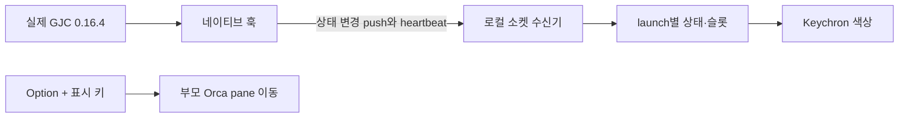

# Orca–GJC–Keychron 제품 문서

**GJC의 상태를 키보드에서 보고, 필요한 부모 터미널로 바로 이동한다.**
Orca 안에서 실행한 대화형 `gjc` 프로세스 하나를 슬롯 하나에 연결한다.
자식 에이전트가 여러 개여도 사람의 응답을 기다리는 상태를 먼저 보여준다.

## 어디부터 읽을까

| 알고 싶은 내용 | 읽을 문서 |
|---|---|
| 왜 이 방식을 선택했는가 | [의사결정 기록](decisions.md) — 채택 이유, 검토한 대안, 영향 |
| 어떤 동작을 제공해야 하는가 | [기능 요구사항](functional.md) — 동작과 수용 기준 |
| 어떤 품질·제약을 지켜야 하는가 | [비기능 요구사항](nonfunctional.md) — 정확성, 복구, 보안, 호환성 |
| 어떤 테스트가 어떤 요구사항을 지키는가 | [테스트 연결표](test-map.md) — 구현 위치와 정확한 테스트 이름 |
| 변경할 때 무엇을 함께 고치는가 | [변경·회귀 방지 절차](maintenance.md) — 자동 검사와 수동 검증 |

## 제품의 핵심 약속

1. **Orca 환경을 유지한다.** 기존 Orca 모드와 GJC 모드는 별도 명령으로 실행하며 키보드·렌더링·이동 코드를 공유한다. GJC 소스 수정이나 upstream PR은 필요하지 않다.
2. **키는 대화형 실행 단위에 고정한다.** 같은 프로세스의 자식·`/new`·`/resume`은 같은 launch에 속한다. 연결이 끊겨도 다른 실행의 키가 갑자기 바뀌지 않는다.
3. **사람 호출을 우선한다.** 연결된 상태에서 10명이 작업 중이고 1명이 답변을 기다리면 주황색이다. 부모 작업 종료만으로 자식의 미해결 질문을 지우지 않는다.
4. **모르는 상태를 성공으로 표시하지 않는다.** 연결 단절과 불완전한 관찰을 드러낸다. 초록색은 관찰된 턴 종료이며 사용자 목표 전체의 완성을 뜻하지 않는다.
5. **입력과 개인정보를 최소한으로 다룬다.** 상태 메타데이터만 전달한다. Option+표시 키는 부모 Orca pane으로 이동하며, 질문에 자동으로 답하거나 자식 답변 화면을 강제로 열지 않는다.

## 현재 지원 범위

GJC 호환성은 **0.16.4**에서 검증했다. 모든 승인창·확장 UI가 관찰되는 것은 아니며,
자식 질문을 감지한 것과 그 질문에 직접 답할 화면으로 이동한 것은 별개의 능력이다.
기본 동작은 부모 터미널 이동이다. 명시적 질문 전달이 필요한 흐름에는 opt-in 의사결정 worker와
parent 지침을 사용한다. 프로세스 재시작 뒤 후속 에이전트에 checkpoint와 답을 넘기는 흐름도
명시적인 전달이며 자동 복구 저장소를 뜻하지 않는다.

상태 push는 GJC 상태를 반복 조회하는 폴링과 구분한다. 2초 heartbeat와 8초 lease는
생존·연결 판단 규칙이다. 이를 LED가 반드시 특정 밀리초 안에 바뀐다는 성능 보장으로 해석하지 않는다.

## 문서와 테스트의 연결 원칙

[requirements.json](requirements.json)이 요구사항·수용 기준·테스트 연결의 편집 원본이고,
[decisions.json](decisions.json)이 의사결정의 편집 원본이다. 위 네 개 상세 문서는 이 두 파일에서 생성한다.
`R01~R45`는 이전 검증과 연결되는 안정적인 ID다. 기능과 비기능 양쪽 성격이 있는 항목은 같은 ID로
두 보기에 나타나며, 서로 다른 요구사항으로 중복 집계하지 않는다.

CI는 원본과 생성 문서가 같은지 확인한 다음, pytest와 Bun을 새로 실행하고 연결된 테스트가
실제로 실행·통과했는지 확인한다. 테스트가 삭제·개명되거나 연결된 사례가 skip되면 검사가 실패한다.
의사결정에서 존재하지 않는 요구사항을 가리키는 경우도 실패한다.

**이 연결은 회귀 위험을 줄이지만 회귀 오류 0개를 보장하지 않는다.** 잘못된 수용 기준,
약한 assertion, 빠진 조합, 실제 모델·하드웨어 차이는 테스트가 통과해도 남을 수 있다.
그래서 연결 검사, 동작 테스트, 독립 검토, 필요한 실제 환경 검증을 함께 사용한다.

## 과거 증거와 현재 기준

[2차 검증 보고서](../testing/gjc-second-audit.md)는 당시 고정한 소스의 Python 456개·Bun 44개,
실제 GJC와 로컬 응답 대역 실험, 독립 리뷰 결과를 보존한다. 새 문서 검사 테스트가 추가된 현재
실행 수와 구분하며, 과거 PASS 파일을 수정해 새 실행 결과처럼 만들지 않는다.

공개 검증 자료의 개인 경로와 실행환경은 [비식별화 기록](../testing/publication-redaction.md)에 따라
제거했다. 원본·공개본 해시를 구분하며, 이 변환을 새 테스트 실행으로 표시하지 않는다.

실제 GJC의 상태 기록을 설치된 집계·렌더링 코드에 넣어 색을 확인한 실험은 **기록 재생 검증**이다.
물리 LED를 눈으로 본 검증이나 실제 모델의 지침 준수로 확대하지 않는다.
물리 키·LED, 실제 모델, 로그인 서비스 활성화, Ubuntu 실행은 각각 별도 증거가 필요하다.

설치·사용은 [GJC 사용자 가이드](../gjc-guide.md), 상세 구현 계약은
[bridge 계약](../gjc-bridge-contract.md), 문서의 역사와 탐색 순서는 [문서 안내](../README.md)를 따른다.
